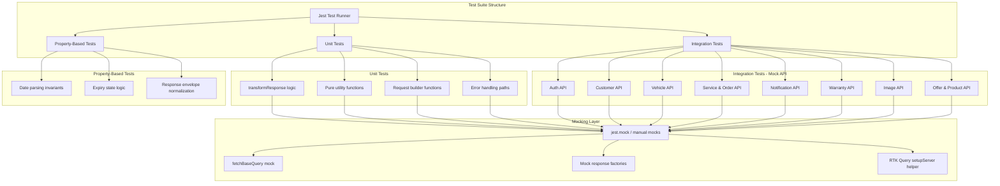
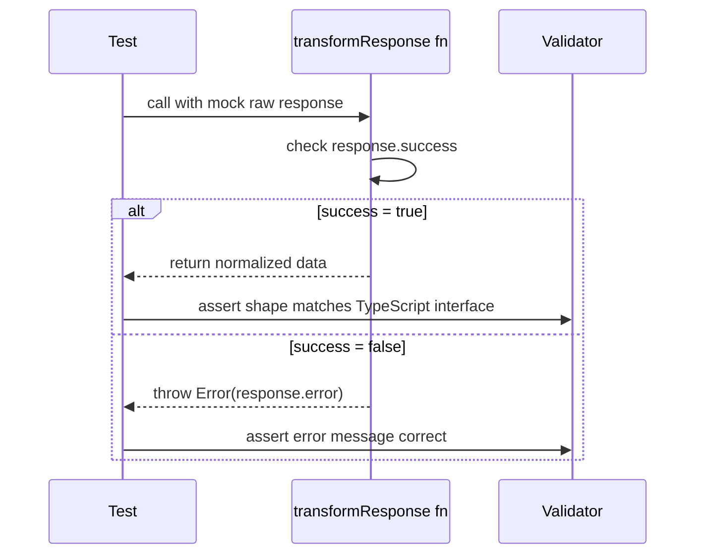
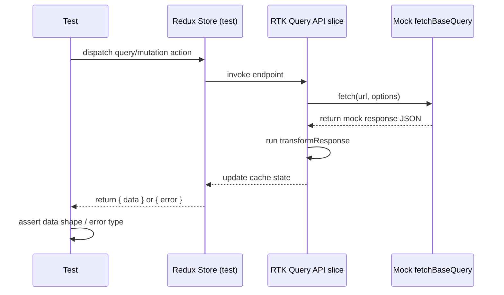

# Design Document: API Testing Suite (TNAuto)

## Overview

Tài liệu này mô tả thiết kế cho bộ test suite bao phủ toàn bộ các API service trong app React Native TNAuto. App quản lý xe ô tô với các chức năng: đăng nhập khách hàng, quản lý xe, đơn dịch vụ, bảo hành, thông báo, sản phẩm và ưu đãi — tất cả được xây dựng trên RTK Query (Redux Toolkit Query) với Jest làm test runner.

Mục tiêu là tạo một test suite có thể chạy hoàn toàn offline (không cần backend thật), sử dụng mock responses để kiểm tra: (1) shape của request/response, (2) logic `transformResponse`, (3) error handling, và (4) các edge case quan trọng.

Dự án đã có `fast-check` trong devDependencies, cho phép bổ sung property-based tests cho các hàm pure như `parseDate`, `getExpiryMeta`, và các transformer.

## Architecture



## Sequence Diagrams

### Flow: Unit Test cho transformResponse



### Flow: Integration Test với Mock Fetch



## Components and Interfaces

### Component 1: Mock Response Factories

**Purpose**: Tạo mock data đúng shape cho từng API, tái sử dụng across tests.

**Interface**:
```typescript
// src/services/__tests__/factories/index.ts

interface MockFactories {
  makeCustomer(overrides?: Partial<Customer>): Customer
  makeVehicle(overrides?: Partial<Vehicle>): Vehicle
  makeServiceOrder(overrides?: Partial<ServiceOrder>): ServiceOrder
  makeWarranty(overrides?: Partial<Warranty>): Warranty
  makeNotification(overrides?: Partial<Notification>): Notification
  makeGarageSummary(overrides?: Partial<GarageSummary>): GarageSummary
  makeApiResponse<T>(data: T, overrides?: Partial<ApiResponse<T>>): ApiResponse<T>
  makeErrorResponse(error: string, status?: number): { success: false; error: string }
}
```

**Responsibilities**:
- Cung cấp default values hợp lệ cho mọi required field
- Cho phép override từng field qua `overrides` parameter
- Đảm bảo type safety với TypeScript generics

### Component 2: Test Store Setup

**Purpose**: Tạo Redux store cô lập cho mỗi test, tránh state leak giữa các test cases.

**Interface**:
```typescript
// src/services/__tests__/helpers/testStore.ts

interface TestStoreConfig {
  preloadedState?: Partial<RootState>
  extraReducers?: Record<string, Reducer>
}

function createTestStore(config?: TestStoreConfig): {
  store: EnhancedStore
  dispatch: AppDispatch
  getState: () => RootState
}
```

**Responsibilities**:
- Khởi tạo store với tất cả API reducers
- Hỗ trợ preloaded state cho auth context (userId, token, garageCode)
- Reset store sau mỗi test

### Component 3: API Mock Interceptor

**Purpose**: Mock `fetchBaseQuery` để intercept HTTP calls mà không cần network.

**Interface**:
```typescript
// src/services/__tests__/helpers/mockFetch.ts

interface MockFetchOptions {
  url: string | RegExp
  method?: 'GET' | 'POST' | 'PUT' | 'PATCH' | 'DELETE'
  response: unknown
  status?: number
  delay?: number
}

function setupMockFetch(handlers: MockFetchOptions[]): {
  cleanup: () => void
  getCallCount: (url: string) => number
  getLastCall: (url: string) => RequestInit | undefined
}
```

**Responsibilities**:
- Intercept fetch calls theo URL pattern
- Trả về mock response với status code tùy chỉnh
- Ghi lại call history để assert trong tests

### Component 4: Test Suites per API Domain

**Purpose**: Nhóm tests theo domain, mỗi file test một API slice.

**Responsibilities**:
- `auth.unit.test.ts` — transformResponse, request builders
- `customer.unit.test.ts` — loginCustomer, registerCustomer, profile mutations
- `vehicle.unit.test.ts` — CRUD operations, pagination transform
- `serviceOrder.unit.test.ts` — createOrder, status transitions
- `notification.unit.test.ts` — normalizeBoolean, extractOrderId, scope routing
- `warranty.unit.test.ts` — getWarranties, completeServiceOrder
- `documentExpiry.unit.test.ts` — parseDate, getExpiryMeta (pure functions)
- `pbt.property.test.ts` — property-based tests với fast-check

## Data Models

### Model: TestScenario

```typescript
interface TestScenario<TInput, TExpected> {
  name: string
  input: TInput
  expected: TExpected
  shouldThrow?: boolean
  errorMessage?: string
}
```

### Model: MockApiHandler

```typescript
interface MockApiHandler {
  url: string | RegExp
  method: HttpMethod
  responseBody: unknown
  statusCode: number  // default: 200
  networkError?: boolean  // simulate fetch failure
}
```

### Model: AuthState (for test preloading)

```typescript
interface TestAuthState {
  isLoggedIn: boolean
  userId: string
  userType: 'customer' | 'employee'
  token?: string
  userPhone?: string
}
```

**Validation Rules**:
- `userId` phải là non-empty string khi `isLoggedIn = true`
- `token` chỉ cần thiết cho employee/manager endpoints
- `userType` ảnh hưởng đến header `x-customer-id` trong baseApi

## Algorithmic Pseudocode

### Main Processing Algorithm: transformResponse Testing Pattern

```typescript
ALGORITHM testTransformResponse<TRaw, TResult>(
  transformFn: (raw: TRaw) => TResult,
  scenarios: TestScenario<TRaw, TResult>[]
): void

INPUT: transformFn — hàm transformResponse cần test
       scenarios — danh sách test cases
OUTPUT: Jest test results

BEGIN
  FOR each scenario IN scenarios DO
    ASSERT scenario.name is non-empty string
    
    IF scenario.shouldThrow = true THEN
      ASSERT_THROWS(() => transformFn(scenario.input), scenario.errorMessage)
    ELSE
      result ← transformFn(scenario.input)
      ASSERT deepEqual(result, scenario.expected)
    END IF
  END FOR
END
```

**Preconditions:**
- `transformFn` là pure function (no side effects)
- `scenarios` có ít nhất 1 phần tử
- Mỗi scenario có `name` unique

**Postconditions:**
- Tất cả scenarios được chạy
- Không có unhandled exceptions ngoài `shouldThrow` cases

**Loop Invariants:**
- Mỗi scenario được test độc lập, không ảnh hưởng lẫn nhau

---

### Validation Algorithm: Response Shape Validator

```typescript
ALGORITHM validateResponseShape<T>(
  response: unknown,
  requiredFields: (keyof T)[],
  optionalFields: (keyof T)[]
): ValidationResult

INPUT: response — raw API response object
       requiredFields — fields phải có mặt
       optionalFields — fields có thể có hoặc không
OUTPUT: { valid: boolean; missingFields: string[]; extraFields: string[] }

BEGIN
  missingFields ← []
  
  FOR each field IN requiredFields DO
    IF field NOT IN response THEN
      missingFields.push(field)
    END IF
  END FOR
  
  IF missingFields.length > 0 THEN
    RETURN { valid: false, missingFields, extraFields: [] }
  END IF
  
  RETURN { valid: true, missingFields: [], extraFields: [] }
END
```

**Preconditions:**
- `response` là object (không phải null/undefined)
- `requiredFields` không rỗng

**Postconditions:**
- `valid = true` khi và chỉ khi tất cả required fields có mặt
- `missingFields` chứa đúng các fields bị thiếu

---

### Error Handling Algorithm: API Error Classification

```typescript
ALGORITHM classifyApiError(error: unknown): ErrorClassification

INPUT: error — lỗi từ RTK Query (FetchBaseQueryError | SerializedError)
OUTPUT: { type: ErrorType; message: string; retryable: boolean }

BEGIN
  IF error has status field THEN
    SWITCH error.status DO
      CASE 401: RETURN { type: 'AUTH_ERROR', message: 'Unauthorized', retryable: false }
      CASE 404: RETURN { type: 'NOT_FOUND', message: 'Resource not found', retryable: false }
      CASE 429: RETURN { type: 'RATE_LIMIT', message: 'Too many requests', retryable: true }
      CASE 'TIMEOUT_ERROR': RETURN { type: 'TIMEOUT', message: 'Request timed out', retryable: true }
      CASE 'FETCH_ERROR': RETURN { type: 'NETWORK', message: 'Network error', retryable: true }
      DEFAULT: RETURN { type: 'SERVER_ERROR', message: 'Server error', retryable: false }
    END SWITCH
  END IF
  
  RETURN { type: 'UNKNOWN', message: String(error), retryable: false }
END
```

## Key Functions with Formal Specifications

### Function 1: `parseDate` (DocumentExpiryCards)

```typescript
function parseDate(value?: string | null): Date | null
```

**Preconditions:**
- `value` có thể là string, null, hoặc undefined

**Postconditions:**
- Trả về `null` nếu `value` là null/undefined/empty
- Trả về `null` nếu `value` không parse được thành Date hợp lệ
- Trả về `Date` object hợp lệ nếu `value` là ISO date string hợp lệ
- `Number.isNaN(result.getTime())` = false khi result không phải null

**Loop Invariants:** N/A

---

### Function 2: `getExpiryMeta` (DocumentExpiryCards)

```typescript
function getExpiryMeta(expiryDate?: string | null): {
  state: 'missing' | 'valid' | 'expired'
  label: string
  daysLabel: string
  color: string
}
```

**Preconditions:**
- `expiryDate` có thể là string, null, hoặc undefined

**Postconditions:**
- Khi `expiryDate` null/undefined → `state = 'missing'`, `daysLabel = ''`
- Khi date đã qua → `state = 'expired'`, `daysLabel` chứa số ngày dương
- Khi date chưa qua → `state = 'valid'`, `daysLabel` chứa số ngày dương
- `color` luôn là non-empty string
- `label` luôn là non-empty string

---

### Function 3: `loginCustomer` transformResponse

```typescript
function transformLoginResponse(response: LoginCustomerResponse): LoginCustomerResponse
```

**Preconditions:**
- `response` là object từ backend

**Postconditions:**
- Nếu `response.success = false` → throw Error với message từ `response.error`
- Nếu `response.success = true` → trả về response nguyên vẹn
- Không mutate input response

---

### Function 4: `getCustomerVehicles` transformResponse

```typescript
function transformVehiclesResponse(response: any): GetVehiclesResponse
```

**Preconditions:**
- `response` là object từ backend

**Postconditions:**
- Khi `response.success = true` → `result.data` là array (có thể rỗng)
- Khi `response.success = false` → `result = { success: false, data: [], count: 0, ... }`
- `result.count` = `response.count` hoặc `response.data.length`
- Pagination fields (`total`, `page`, `limit`, `totalPages`, `hasNextPage`) luôn có mặt

---

### Function 5: Notification `normalizeBoolean`

```typescript
function normalizeBoolean(value: unknown): boolean | undefined
```

**Preconditions:**
- `value` có thể là bất kỳ type nào

**Postconditions:**
- `true` khi value là: `true`, `1`, `'1'`, `'true'`
- `false` khi value là: `false`, `0`, `'0'`, `'false'`
- `undefined` cho tất cả các giá trị khác

## Example Usage

### Example 1: Unit test cho transformResponse

```typescript
// src/services/__tests__/vehicle.unit.test.ts
import { vehicleApi } from '../vehicleApi'

describe('vehicleApi - getCustomerVehicles transformResponse', () => {
  const transform = (vehicleApi.endpoints.getCustomerVehicles as any)
    .select // access via endpoint definition in tests

  it('returns empty array when success=false', () => {
    const raw = { success: false, error: 'Not found' }
    // Test the transform logic directly
    const result = transformVehiclesResponse(raw)
    expect(result.data).toEqual([])
    expect(result.success).toBe(false)
  })

  it('normalizes pagination fields', () => {
    const raw = {
      success: true,
      data: [makeVehicle()],
      count: 1,
      total: 10,
      page: 1,
      limit: 20,
    }
    const result = transformVehiclesResponse(raw)
    expect(result.totalPages).toBeDefined()
    expect(result.hasNextPage).toBeDefined()
  })
})
```

### Example 2: Property-based test với fast-check

```typescript
// src/services/__tests__/pbt.property.test.ts
import fc from 'fast-check'
import { parseDate, getExpiryMeta } from '../../screens/Home/DocumentExpiryCards'

describe('parseDate - property tests', () => {
  it('always returns null for non-date strings', () => {
    fc.assert(
      fc.property(
        fc.string().filter(s => isNaN(Date.parse(s))),
        (invalidStr) => {
          expect(parseDate(invalidStr)).toBeNull()
        }
      )
    )
  })

  it('always returns valid Date for ISO date strings', () => {
    fc.assert(
      fc.property(
        fc.date({ min: new Date('2000-01-01'), max: new Date('2099-12-31') }),
        (date) => {
          const result = parseDate(date.toISOString())
          expect(result).not.toBeNull()
          expect(result!.getTime()).not.toBeNaN()
        }
      )
    )
  })
})

describe('getExpiryMeta - property tests', () => {
  it('state is always one of missing/valid/expired', () => {
    fc.assert(
      fc.property(
        fc.option(fc.string(), { nil: null }),
        (dateStr) => {
          const meta = getExpiryMeta(dateStr)
          expect(['missing', 'valid', 'expired']).toContain(meta.state)
        }
      )
    )
  })

  it('daysLabel is empty string when state is missing', () => {
    fc.assert(
      fc.property(
        fc.constantFrom(null, undefined, '', 'not-a-date'),
        (invalidDate) => {
          const meta = getExpiryMeta(invalidDate)
          if (meta.state === 'missing') {
            expect(meta.daysLabel).toBe('')
          }
        }
      )
    )
  })
})
```

### Example 3: Integration test với mock fetch

```typescript
// src/services/__tests__/auth.integration.test.ts
import { authApi } from '../authApi'

describe('authApi - resolveGarageByCode', () => {
  it('throws when success=false', async () => {
    // Mock the transformResponse behavior
    const mockResponse: ResolveGarageResponse = {
      success: false,
      error: 'Garage not found',
    }
    
    expect(() => {
      if (!mockResponse.success || !mockResponse.data) {
        throw new Error(mockResponse.error || 'Failed to resolve garage')
      }
    }).toThrow('Garage not found')
  })

  it('returns garage data when success=true', () => {
    const mockGarage = makeGarageSummary({ code: 'GARAGE001' })
    const mockResponse: ResolveGarageResponse = {
      success: true,
      data: mockGarage,
    }

    // Simulate transformResponse
    if (!mockResponse.success || !mockResponse.data) {
      throw new Error('Should not throw')
    }
    expect(mockResponse.data.code).toBe('GARAGE001')
  })
})
```

## Correctness Properties

### Property 1: Response Envelope Consistency
∀ response ∈ ApiResponse<T>: response.success = true ⟹ response.data ≠ undefined
**Validates: Requirements 1.1**

### Property 2: Error Propagation
∀ transformFn, ∀ response where response.success = false:
  transformFn(response) throws Error ∧ error.message contains response.error
**Validates: Requirements 1.2**

### Property 3: parseDate Determinism
∀ s ∈ String: parseDate(s) = parseDate(s) (same input → same output, no side effects)
**Validates: Requirements 9.1**

### Property 4: getExpiryMeta State Completeness
∀ dateStr ∈ (String | null | undefined):
  getExpiryMeta(dateStr).state ∈ { 'missing', 'valid', 'expired' }
**Validates: Requirements 9.3**

### Property 5: normalizeBoolean Totality
∀ value ∈ Any:
  normalizeBoolean(value) ∈ { true, false, undefined }
**Validates: Requirements 9.5**

### Property 6: Vehicle Transform Fallback
∀ response where response.success = false:
  transformVehiclesResponse(response).data = [] ∧
  transformVehiclesResponse(response).count = 0
**Validates: Requirements 9.7**

### Property 7: Pagination Fields Presence
∀ response where response.success = true:
  transformVehiclesResponse(response) has fields: { total, page, limit, totalPages, hasNextPage }
**Validates: Requirements 9.6**

## Error Handling

### Error Scenario 1: Network Failure (FETCH_ERROR)

**Condition**: `fetch()` throws hoặc network không khả dụng
**Response**: RTK Query trả về `{ error: { status: 'FETCH_ERROR', error: string } }`
**Recovery**: Retry logic trong `baseQueryWithRetry` (max 3 lần, exponential backoff)
**Test**: Mock fetch để throw NetworkError, assert error.status = 'FETCH_ERROR'

### Error Scenario 2: Timeout (TIMEOUT_ERROR)

**Condition**: Request vượt quá 15 giây (timeout trong baseApi)
**Response**: `{ error: { status: 'TIMEOUT_ERROR' } }`
**Recovery**: VehicleInfoCard hiển thị "Quá thời gian" UI với nút retry
**Test**: Mock fetch với delay > timeout, assert error.status = 'TIMEOUT_ERROR'

### Error Scenario 3: Authentication Error (401)

**Condition**: Token hết hạn hoặc không hợp lệ
**Response**: `{ error: { status: 401 } }`
**Recovery**: `retry.fail()` được gọi — không retry, redirect về login
**Test**: Mock 401 response, assert retry KHÔNG được gọi lần 2

### Error Scenario 4: Rate Limiting (429)

**Condition**: Quá nhiều requests trong thời gian ngắn
**Response**: `{ error: { status: 429 } }`
**Recovery**: VehicleInfoCard hiển thị "Đang tải quá nhanh" message
**Test**: Mock 429 response, assert component hiển thị đúng message

### Error Scenario 5: Backend Error Response (success: false)

**Condition**: Backend trả về `{ success: false, error: "..." }`
**Response**: `transformResponse` throw Error với message từ backend
**Recovery**: RTK Query chuyển thành `{ error: { status: 'CUSTOM_ERROR', error: message } }`
**Test**: Mock response với success=false, assert error message đúng

### Error Scenario 6: Missing Required Fields

**Condition**: Backend trả về response thiếu required fields
**Response**: `transformResponse` throw Error hoặc trả về fallback
**Recovery**: Component hiển thị error state
**Test**: Mock response thiếu `data` field, assert fallback behavior

## Testing Strategy

### Unit Testing Approach

Test trực tiếp các `transformResponse` functions và pure utility functions mà không cần Redux store. Đây là layer test nhanh nhất và dễ maintain nhất.

**Key test cases:**
- `transformResponse` với success=true → đúng shape
- `transformResponse` với success=false → throw Error đúng message
- `parseDate` với valid/invalid/null inputs
- `getExpiryMeta` với past/future/null dates
- `normalizeBoolean` với tất cả truthy/falsy variants
- Request URL builders (encodeURIComponent, path params)

**Coverage goals:** 90%+ cho transformResponse functions, 100% cho pure utility functions

### Property-Based Testing Approach

Sử dụng `fast-check` (đã có trong devDependencies) để test các invariants không thể cover hết bằng example-based tests.

**Property Test Library**: fast-check v4.7.0

**Key properties:**
- `parseDate` luôn trả về null hoặc valid Date (không bao giờ throw)
- `getExpiryMeta` luôn trả về state trong tập { missing, valid, expired }
- `normalizeBoolean` luôn trả về boolean hoặc undefined
- Response envelope: success=true ⟹ data không undefined (với transformResponse)

### Integration Testing Approach

Test toàn bộ flow từ mock response → transformResponse → normalized data shape. Không cần Redux store thật — test transformResponse logic trực tiếp.

**Approach**: Extract và test `transformResponse` functions trực tiếp thay vì dispatch Redux actions (tránh phức tạp của RTK Query middleware trong test environment).

**Key integration scenarios:**
- Auth flow: login → linked_garages normalization
- Vehicle CRUD: create → invalidate cache → refetch
- Notification: scope routing (customer vs employee vs dealer)
- Warranty: completeServiceOrder → warranty creation

## Performance Considerations

- Mỗi test file chạy độc lập, không share state
- Mock factories dùng object spread để tránh mutation
- Property-based tests giới hạn số lần chạy (`numRuns: 100`) để test suite không quá chậm
- Test files được tổ chức theo domain để Jest có thể chạy parallel

## Security Considerations

- Không hardcode credentials thật trong test files
- Mock auth state dùng fake userId/token
- Test error cases cho 401 để đảm bảo auth errors không bị retry
- Kiểm tra `nonAuthEndpoints` set trong baseApi — các endpoint này không được gửi Authorization header

## Dependencies

| Dependency | Version | Mục đích |
|---|---|---|
| `jest` | ^29.6.3 | Test runner |
| `@types/jest` | ^29.5.13 | TypeScript types |
| `fast-check` | ^4.7.0 | Property-based testing |
| `@reduxjs/toolkit` | ^2.9.0 | RTK Query (đã có) |
| `react-test-renderer` | 19.1.0 | Component rendering (nếu cần) |

Không cần cài thêm dependency mới — tất cả đã có sẵn trong project.
