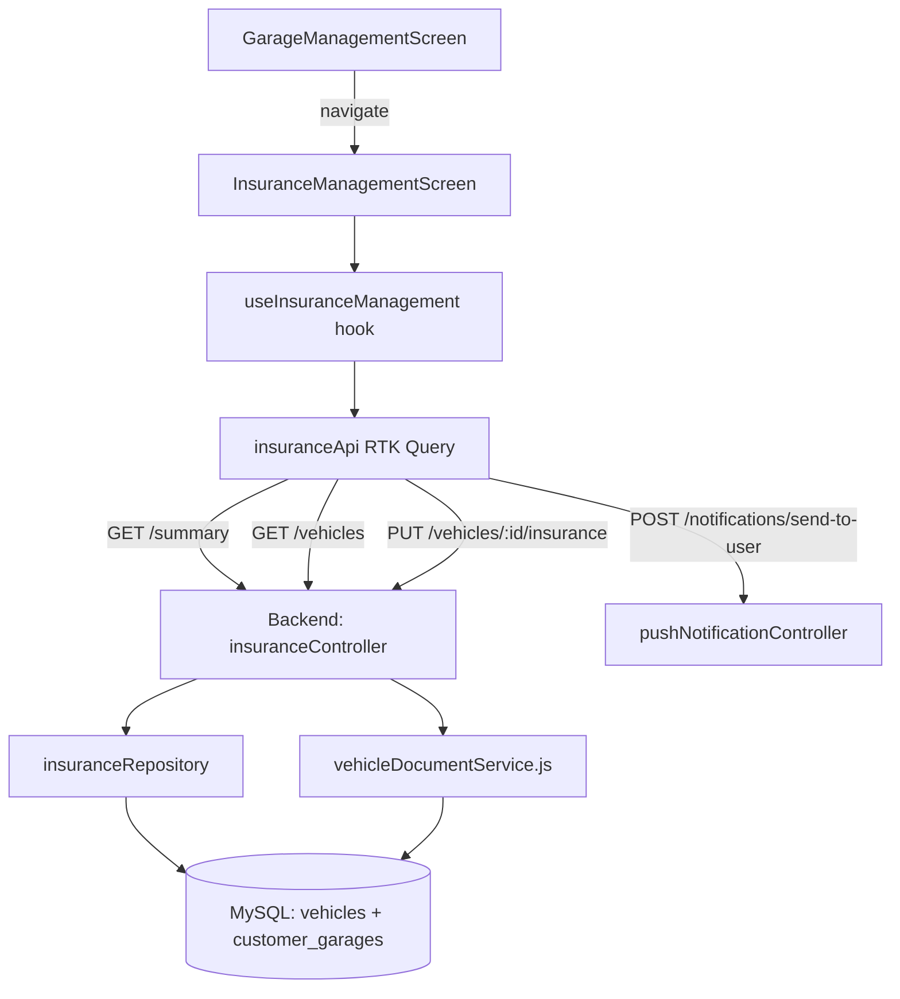

# Design Document: Insurance Management

## Overview

Tính năng **Quản lý Bảo hiểm** bổ sung vào trang Manager của ứng dụng TNAuto một giao diện chuyên biệt để người quản lý gara theo dõi và quản lý trạng thái bảo hiểm xe của toàn bộ khách hàng.

Thông tin bảo hiểm (`insurance_company`, `insurance_start_date`, `insurance_expiry_date`, `insurance_image_url`) đã tồn tại trên bảng `vehicles` ở backend, và logic tính `insurance_status` đã có trong `vehicleDocumentService.js`. Tính năng này xây dựng lớp API chuyên biệt và giao diện quản lý tập trung phía trên nền tảng đó.

### Phạm vi thay đổi

- **Backend**: 3 endpoint mới trong `src/routes/app/manager.js`, 1 controller mới `insuranceController.js`, 1 repository mới `insuranceRepository.js`.
- **Frontend**: 1 RTK Query API slice mới `insuranceApi.ts`, 1 hook `useInsuranceManagement.ts`, 1 màn hình `InsuranceManagementScreen.tsx` + view, đăng ký route mới, thêm thẻ vào `GarageManagementScreen`.

---

## Architecture



### Luồng dữ liệu chính

1. Manager mở màn hình → `useInsuranceManagement` gọi `getInsuranceSummary` và `getInsuranceVehicles` song song.
2. Manager nhấn KPI card → hook cập nhật `activeFilter`, danh sách tự lọc từ cache RTK Query.
3. Manager nhấn xe → hiển thị form chi tiết, Manager chỉnh sửa và nhấn Lưu → `updateVehicleInsurance` mutation.
4. Manager nhấn Nhắc nhở → dialog xác nhận → `sendInsuranceReminder` mutation gọi push notification API.

---

## Components and Interfaces

### Frontend Components

#### `InsuranceManagementScreen` (container)
- File: `src/screens/GarageManagement/InsuranceManagementScreen.tsx`
- Vai trò: Container screen, kết nối hook với view, xử lý navigation guard.
- Sử dụng `withRoleGuard` pattern hiện có hoặc kiểm tra `isManagerRole` trực tiếp.

#### `useInsuranceManagement` (hook)
- File: `src/hooks/useInsuranceManagement.ts`
- Trả về view-model cho `InsuranceManagementView`.
- Quản lý: `activeFilter`, `searchQuery`, `selectedVehicle`, `isDetailVisible`.

#### `InsuranceManagementView` (view)
- File: `src/screens/GarageManagement/InsuranceManagementView.tsx`
- Render thuần túy, nhận props từ hook.
- Gồm: `InsuranceSummaryCards`, `InsuranceVehicleList`, `InsuranceDetailForm`.

### Backend Components

#### `insuranceController.js`
- File: `src/controllers/app/insuranceController.js`
- Methods: `getSummary`, `getVehicles`, `updateInsurance`.

#### `insuranceRepository.js`
- File: `src/domains/insurance/insuranceRepository.js`
- Methods: `getSummaryByGarage`, `getVehiclesWithInsurance`.
- Tái sử dụng `buildVehicleDocumentSelect` từ `vehicleDocumentService.js`.

---

## Data Models

### InsuranceStatus (Frontend Type)

```typescript
export type InsuranceStatus = 'expired' | 'expiring' | 'valid' | 'missing';

export type InsuranceFilterOption = 'all' | InsuranceStatus;
```

### InsuranceVehicle (Frontend Type)

```typescript
export interface InsuranceVehicle {
  id: number;
  license_plate: string;
  model?: string | null;
  customer_id: number;
  customer_name: string;
  customer_phone: string;
  insurance_company?: string | null;
  insurance_start_date?: string | null;
  insurance_expiry_date?: string | null;
  insurance_image_url?: string | null;
  insurance_status: InsuranceStatus;
}
```

### InsuranceSummary (Frontend Type)

```typescript
export interface InsuranceSummary {
  expired: number;
  expiring: number;
  valid: number;
  missing: number;
  total: number;
}
```

### UpdateInsuranceRequest (Frontend Type)

```typescript
export interface UpdateInsuranceRequest {
  vehicleId: number;
  insurance_company?: string | null;
  insurance_start_date?: string | null;
  insurance_expiry_date?: string | null;
  insurance_image_url?: string | null;
}
```

### Backend SQL — Insurance Status Calculation

Logic tính `insurance_status` tái sử dụng `buildVehicleDocumentSelect` từ `vehicleDocumentService.js`:

```sql
CASE
  WHEN v.insurance_expiry_date IS NULL THEN 'missing'
  WHEN v.insurance_expiry_date < CURDATE() THEN 'expired'
  WHEN v.insurance_expiry_date <= DATE_ADD(CURDATE(), INTERVAL 30 DAY) THEN 'expiring'
  ELSE 'valid'
END AS insurance_status
```

**Lưu ý quan trọng**: Backend hiện tại trả về `NULL` (không phải `'missing'`) khi `insurance_expiry_date IS NULL`. Controller mới sẽ dùng `COALESCE` để chuẩn hóa thành `'missing'` trong query summary, và frontend helper cũng xử lý `null` → `'missing'`.

### Frontend Helper — `calculateInsuranceStatus`

```typescript
// src/utils/insuranceUtils.ts
export function calculateInsuranceStatus(
  expiryDate: string | null | undefined,
  today: Date = new Date(),
): InsuranceStatus {
  if (!expiryDate) return 'missing';
  const expiry = new Date(expiryDate);
  const threshold = new Date(today);
  threshold.setDate(threshold.getDate() + 30);
  if (expiry < today) return 'expired';
  if (expiry <= threshold) return 'expiring';
  return 'valid';
}
```

### API Endpoints

#### `GET /api/app/manager/insurance/summary`

Response:
```json
{
  "success": true,
  "data": {
    "expired": 3,
    "expiring": 5,
    "valid": 42,
    "missing": 8,
    "total": 58
  }
}
```

#### `GET /api/app/manager/insurance/vehicles`

Query params: `status` (optional: `expired|expiring|valid|missing`), `q` (optional: search string).

Response:
```json
{
  "success": true,
  "data": [
    {
      "id": 1,
      "license_plate": "51A-12345",
      "customer_name": "Nguyễn Văn A",
      "customer_phone": "0901234567",
      "insurance_company": "Bảo Việt",
      "insurance_expiry_date": "2024-12-31",
      "insurance_status": "expired"
    }
  ],
  "count": 1
}
```

#### `PUT /api/app/manager/vehicles/:id/insurance`

Request body:
```json
{
  "insurance_company": "Bảo Việt",
  "insurance_start_date": "2025-01-01",
  "insurance_expiry_date": "2026-01-01",
  "insurance_image_url": "https://..."
}
```

Response:
```json
{
  "success": true,
  "data": { /* updated vehicle */ },
  "message": "Cập nhật thông tin bảo hiểm thành công"
}
```

### RTK Query API Slice — `insuranceApi.ts`

```typescript
export const insuranceApi = createApi({
  ...API_CONFIG,
  reducerPath: 'insuranceApi',
  baseQuery: baseQueryWithRetry,
  tagTypes: ['InsuranceSummary', 'InsuranceVehicle'],
  endpoints: (builder) => ({
    getInsuranceSummary: builder.query<InsuranceSummary, void>({ ... }),
    getInsuranceVehicles: builder.query<InsuranceVehicle[], { status?: InsuranceFilterOption; q?: string }>({ ... }),
    updateVehicleInsurance: builder.mutation<void, UpdateInsuranceRequest>({ ... }),
    sendInsuranceReminder: builder.mutation<void, { vehicleId: number; customerId: number }>({ ... }),
  }),
});
```

---

## Correctness Properties

*A property is a characteristic or behavior that should hold true across all valid executions of a system — essentially, a formal statement about what the system should do. Properties serve as the bridge between human-readable specifications and machine-verifiable correctness guarantees.*

### Property 1: KPI Sum Invariant

*For any* list of vehicles belonging to a garage, the sum of `expired + expiring + valid + missing` counts returned by `getInsuranceSummary` SHALL equal the total number of vehicles in that garage.

**Validates: Requirements 1.2**

---

### Property 2: Insurance Status Calculation Correctness

*For any* `insurance_expiry_date` value (including null), the `calculateInsuranceStatus` frontend helper and the backend SQL CASE expression SHALL produce the same `InsuranceStatus` result, using the same 30-day `Expiry_Threshold`.

Specifically:
- `null` or missing → `'missing'`
- date < today → `'expired'`
- today ≤ date ≤ today+30 → `'expiring'`
- date > today+30 → `'valid'`

**Validates: Requirements 4.1, 4.2, 4.3, 4.4, 4.5**

---

### Property 3: Status Filter Correctness

*For any* `InsuranceFilterOption` value (other than `'all'`) and *any* list of vehicles, all vehicles returned by `getInsuranceVehicles` with that filter SHALL have `insurance_status` equal to the requested filter value. No vehicle with a different status shall appear in the result.

**Validates: Requirements 2.2, 5.6**

---

### Property 4: Search Filter Correctness

*For any* non-empty search query string `q` and *any* list of vehicles, all vehicles returned by `getInsuranceVehicles` with that query SHALL have either `license_plate` or `customer_name` containing `q` as a case-insensitive substring. No vehicle that does not match shall appear in the result.

**Validates: Requirements 2.4**

---

### Property 5: Priority Sort Order Invariant

*For any* list of vehicles with mixed `insurance_status` values, after applying the priority sort, all `'expired'` vehicles SHALL appear before all `'expiring'` vehicles, which SHALL appear before all `'valid'` vehicles, which SHALL appear before all `'missing'` vehicles.

**Validates: Requirements 2.5**

---

### Property 6: Date Validation Round-Trip

*For any* string that matches the regex `^\d{4}-\d{2}-\d{2}$` and represents a valid calendar date, the `validateInsuranceDate` function SHALL accept it as valid. *For any* string that does not match this format or represents an invalid calendar date, the function SHALL reject it as invalid.

**Validates: Requirements 3.2, 3.3**

---

### Property 7: Reminder Button Visibility

*For any* vehicle record, the "Nhắc nhở" button SHALL be visible if and only if `insurance_status` is `'expiring'` or `'expired'`. For vehicles with `insurance_status` of `'valid'` or `'missing'`, the button SHALL NOT be rendered.

**Validates: Requirements 7.5**

---

### Property 8: Role-Based Access Control

*For any* user with a role that is not `garage_manager` or `garage_admin`, attempting to access the `InsuranceManagement` screen SHALL result in redirection (to Home if authenticated, to Login if unauthenticated). The insurance card in `GarageManagementScreen` SHALL NOT be rendered for non-manager roles.

**Validates: Requirements 6.4, 8.1, 8.2**

---

### Property 9: Garage Data Isolation

*For any* manager's garage context, all vehicles returned by insurance endpoints SHALL belong exclusively to that garage (linked via `customer_garages.garage_id`). No vehicle from another garage SHALL appear in the response.

**Validates: Requirements 5.7**

---

### Property 10: API Authorization

*For any* request to insurance endpoints (`/summary`, `/vehicles`, `PUT /vehicles/:id/insurance`) without a valid Bearer token, the response SHALL be HTTP 401. *For any* request with a valid token whose role is not `garage_manager` or `garage_admin`, the response SHALL be HTTP 403.

**Validates: Requirements 5.4, 5.5**

---

## Error Handling

### Frontend Error States

| Tình huống | Xử lý |
|---|---|
| API summary/vehicles lỗi | Hiển thị error box với icon + message + nút "Thử lại" (pattern từ `GarageManagementScreen`) |
| API update thất bại | Toast lỗi, giữ nguyên form, không đóng modal |
| API send notification thất bại | Toast lỗi, không thay đổi trạng thái xe |
| Ngày nhập sai định dạng | Inline validation error dưới field |
| Network timeout | RTK Query retry tự động (3 lần, exponential backoff từ `baseApi.ts`) |

### Backend Error Responses

| Tình huống | HTTP Status | error_code |
|---|---|---|
| Không có token | 401 | `UNAUTHORIZED` |
| Token hợp lệ nhưng sai role | 403 | `FORBIDDEN_ROLE` |
| Không tìm thấy xe | 404 | `NOT_FOUND` |
| Ngày không hợp lệ | 400 | `VALIDATION_ERROR` |
| Không có garage context | 400 | `GARAGE_CONTEXT_REQUIRED` |

---

## Testing Strategy

### Unit Tests

Tập trung vào pure functions và business logic:

- `calculateInsuranceStatus(expiryDate, today)` — tất cả 4 nhánh + null/undefined
- `validateInsuranceDate(dateString)` — valid/invalid formats
- `sortVehiclesByInsurancePriority(vehicles)` — ordering invariant
- `filterVehiclesByStatus(vehicles, status)` — filter correctness
- `filterVehiclesBySearch(vehicles, query)` — case-insensitive search

### Property-Based Tests

Sử dụng **fast-check** (TypeScript) cho frontend và **fast-check** hoặc **jest-fast-check** cho backend logic.

Mỗi property test chạy tối thiểu **100 iterations**.

Tag format: `Feature: insurance-management, Property {N}: {property_text}`

| Property | Test | Generators |
|---|---|---|
| P1: KPI Sum Invariant | `fc.array(fc.record({ insurance_expiry_date: fc.option(fc.date()) }))` → verify sum == total | Array of vehicle-like objects |
| P2: Status Calculation | `fc.option(fc.date())` → compare frontend helper vs reference impl | Nullable dates |
| P3: Status Filter | `fc.array(vehicleArb), fc.constantFrom('expired','expiring','valid','missing')` → all results match filter | Vehicle array + status |
| P4: Search Filter | `fc.array(vehicleArb), fc.string()` → all results contain query | Vehicle array + query string |
| P5: Sort Order | `fc.array(vehicleArb)` → verify priority ordering | Mixed-status vehicle array |
| P6: Date Validation | `fc.string()` → valid YYYY-MM-DD accepted, others rejected | Arbitrary strings |
| P7: Reminder Visibility | `fc.constantFrom('expired','expiring','valid','missing')` → button shown iff expiring/expired | Status values |
| P8: Role Access Control | `fc.constantFrom('customer','employee','dealer')` → access denied | Non-manager roles |
| P9: Garage Isolation | Two garages with vehicles → each manager only sees own vehicles | Garage + vehicle sets |
| P10: API Auth | Requests without/with wrong token → 401/403 | Token variants |

### Integration Tests

- `GET /api/app/manager/insurance/summary` — trả về đúng counts cho garage
- `GET /api/app/manager/insurance/vehicles?status=expired` — chỉ trả về xe expired
- `PUT /api/app/manager/vehicles/:id/insurance` — cập nhật đúng fields
- Middleware chain: `requireGarageManagerAuth` + `requireGarageContext` hoạt động đúng

### E2E / Manual Tests

- Luồng đầy đủ: Mở màn hình → xem KPI → lọc → xem chi tiết → cập nhật → xem status thay đổi
- Luồng nhắc nhở: Nhấn Nhắc nhở → dialog → xác nhận → toast thành công
- Kiểm tra phân quyền: Đăng nhập với role customer → không thấy thẻ Bảo hiểm
