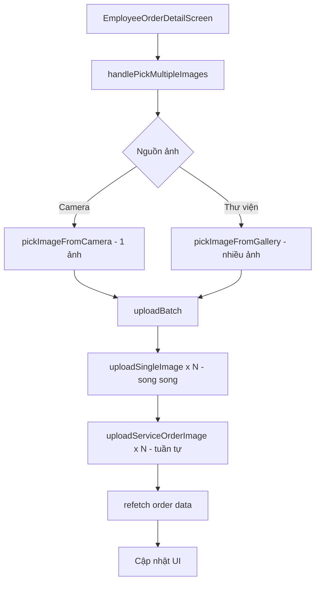
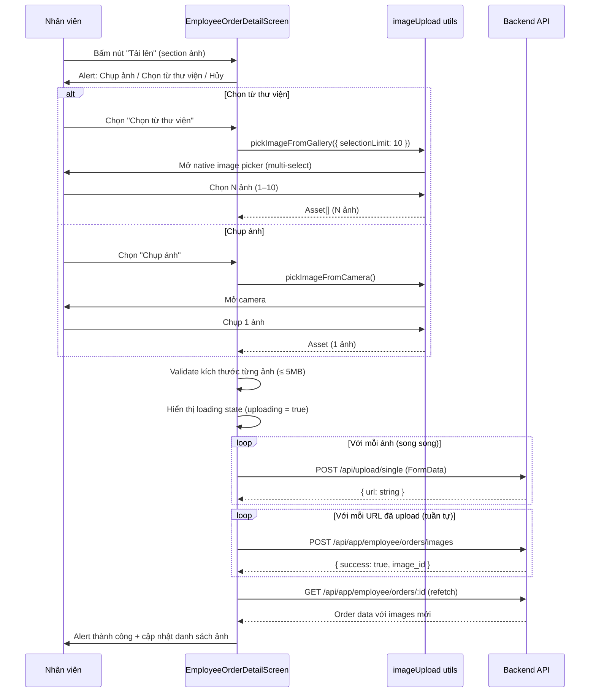

# Design Document: Multi-Image Upload cho Dịch vụ

## Overview

Tính năng này cho phép nhân viên (employee) chọn và upload nhiều ảnh cùng lúc khi ghi nhận ảnh dịch vụ trong `EmployeeOrderDetailScreen`, thay vì phải lặp lại thao tác chọn-upload từng ảnh một. Giải pháp tận dụng `MultiImagePicker` component và `pickImageFromGallery` utility đã có sẵn trong codebase, đồng thời giữ nguyên luồng upload tuần tự lên backend (upload từng ảnh → lưu metadata) để tương thích với API hiện tại.

Phạm vi thay đổi tập trung hoàn toàn ở frontend (`EmployeeOrderDetailScreen.tsx` và `imageUpload.ts`). Backend không cần thay đổi vì đã có đủ endpoint cần thiết: `POST /api/upload/single` và `POST /api/app/employee/orders/images`.

## Architecture





## Components and Interfaces

### Component: EmployeeOrderDetailScreen (sửa đổi)

**Mục đích**: Màn hình xử lý đơn dịch vụ của nhân viên. Cần thay thế logic upload ảnh đơn lẻ bằng logic upload nhiều ảnh.

**Thay đổi chính**:

```typescript
// Thay thế handleUploadImage (single) bằng handleUploadImages (multi)
interface UploadBatchResult {
  successCount: number;
  failCount: number;
  errors: string[];
}

// State mới
const [uploadingSection, setUploadingSection] = useState<string | null>(null);
// Thay thế: const [uploading, setUploading] = useState(false);
// Lý do: cần biết section nào đang upload để disable đúng nút
```

**Interface của hàm upload mới**:

```typescript
// Hàm upload batch — nhận mảng Asset, upload song song lên storage,
// sau đó lưu metadata tuần tự vào DB
async function handleUploadImages(
  statusAtTime: string,   // 'received' | 'completed'
  source: 'camera' | 'gallery'
): Promise<void>

// Hàm hiển thị picker options (không thay đổi signature)
function handlePickImage(statusAtTime: string): void
```

### Utility: imageUpload.ts (sửa đổi nhỏ)

**Mục đích**: `pickImageFromGallery` đã hỗ trợ `selectionLimit` nhưng hiện tại `EmployeeOrderDetailScreen` gọi với `selectionLimit: 1`. Cần truyền đúng limit.

Không cần thêm hàm mới — chỉ cần truyền `selectionLimit` phù hợp khi gọi `pickImageFromGallery`.

### Component: MultiImagePicker (không thay đổi)

Component này đã hoàn chỉnh và được dùng ở `VehicleEditScreen`. Tính năng multi-image upload cho service order **không dùng** `MultiImagePicker` component vì:
- Flow của service order images khác: ảnh được upload ngay lập tức và lưu vào DB, không cần state trung gian
- UI hiển thị ảnh đã upload dùng `FlatList` ngang (đã có sẵn), không cần grid picker
- Thêm `MultiImagePicker` vào đây sẽ làm phức tạp không cần thiết

## Data Models

### Không thay đổi schema

Backend API và DB schema giữ nguyên. Mỗi ảnh vẫn là một record riêng trong `serviceorderimages`:

```typescript
interface ServiceOrderImage {
  id: string;
  order_id: string;
  image_url: string;          // URL sau khi upload lên storage
  status_at_time: string;     // 'received' | 'completed'
  description?: string;
  uploaded_by: string;        // employee_id
  created_at?: string;
}
```

### Upload flow (không thay đổi API contract)

```typescript
// Bước 1: Upload file lên storage (song song cho nhiều ảnh)
// POST /api/upload/single
// Body: FormData { image: File }
// Response: { success: boolean, url: string, filename: string }

// Bước 2: Lưu metadata vào DB (một lần cho mỗi ảnh)
// POST /api/app/employee/orders/images
// Body: { order_id, image_url, status_at_time, uploaded_by, description? }
// Response: { success: boolean, image_id: string, message: string }
```

## Algorithmic Pseudocode

### Thuật toán upload nhiều ảnh

```pascal
PROCEDURE handleUploadImages(statusAtTime, source)
  INPUT: statusAtTime: string, source: 'camera' | 'gallery'
  OUTPUT: void (side effects: upload ảnh, cập nhật UI)

  SEQUENCE
    // Guard: kiểm tra quyền
    IF NOT canUploadImages THEN
      Alert("Bạn chỉ có thể tải ảnh lên khi đơn thuộc về mình.")
      RETURN
    END IF

    IF uploadingSection IS NOT NULL THEN
      Alert("Đang tải ảnh lên, vui lòng đợi...")
      RETURN
    END IF

    // Bước 1: Chọn ảnh
    IF source = 'camera' THEN
      assets ← [pickImageFromCamera({ maxWidth: 1920, maxHeight: 1920, quality: 0.8 })]
      IF assets[0] IS NULL THEN RETURN END IF
    ELSE
      assets ← pickImageFromGallery({
        maxWidth: 1920,
        maxHeight: 1920,
        quality: 0.8,
        selectionLimit: MAX_IMAGES_PER_UPLOAD  // 10
      })
      IF assets IS EMPTY THEN RETURN END IF
    END IF

    // Bước 2: Validate kích thước
    FOR each asset IN assets DO
      IF NOT validateImageSize(asset, maxSizeMB: 5) THEN
        RETURN  // validateImageSize đã hiển thị Alert
      END IF
    END FOR

    // Bước 3: Upload
    setUploadingSection(statusAtTime)
    TRY
      // Upload file lên storage — song song để nhanh hơn
      uploadResults ← AWAIT Promise.all(
        assets.map(asset =>
          uploadSingleImage(createImageFormData(asset, 'image')).unwrap()
        )
      )

      // Lưu metadata vào DB — tuần tự để tránh race condition
      FOR each result IN uploadResults DO
        AWAIT uploadServiceOrderImage({
          order_id: id,
          image_url: result.url,
          status_at_time: statusAtTime,
          uploaded_by: currentEmployeeId,
          description: ''
        }).unwrap()
      END FOR

      // Thông báo kết quả
      successCount ← uploadResults.length
      Alert("Tải lên thành công " + successCount + " ảnh.")
      AWAIT refetch()

    CATCH uploadError
      Alert("Lỗi", getApiErrorMessage(uploadError, "Tải ảnh lên thất bại."))
    FINALLY
      setUploadingSection(NULL)
    END TRY
  END SEQUENCE
END PROCEDURE
```

**Preconditions:**
- `canUploadImages` là `true` (nhân viên đang giữ đơn)
- `uploadingSection` là `null` (không có upload nào đang chạy)
- `id` (order ID) hợp lệ
- `currentEmployeeId` không null

**Postconditions:**
- Tất cả ảnh được chọn đã được upload lên storage và metadata đã được lưu vào DB
- `uploadingSection` được reset về `null`
- Order data được refetch để hiển thị ảnh mới
- Nếu có lỗi ở bất kỳ bước nào, Alert lỗi được hiển thị và `uploadingSection` vẫn được reset

**Loop Invariants:**
- Trong vòng lặp lưu metadata: mỗi `result.url` đã được upload thành công lên storage trước khi lưu metadata

### Thuật toán hiển thị picker options (không thay đổi)

```pascal
PROCEDURE handlePickImage(statusAtTime)
  INPUT: statusAtTime: string
  OUTPUT: void

  SEQUENCE
    IF NOT canUploadImages THEN
      Alert("Bạn chỉ có thể tải ảnh lên khi đơn thuộc về mình.")
      RETURN
    END IF

    showImagePickerOptions(
      onCamera: () => handleUploadImages(statusAtTime, 'camera'),
      onGallery: () => handleUploadImages(statusAtTime, 'gallery')
    )
  END SEQUENCE
END PROCEDURE
```

## Key Functions với Formal Specifications

### handleUploadImages

```typescript
async function handleUploadImages(
  statusAtTime: string,
  source: 'camera' | 'gallery'
): Promise<void>
```

**Preconditions:**
- `canUploadImages === true`
- `uploadingSection === null`
- `id` là order ID hợp lệ (string)
- `currentEmployeeId` không null

**Postconditions:**
- Nếu thành công: tất cả ảnh được lưu vào DB, `uploadingSection === null`, order data được refetch
- Nếu thất bại: Alert lỗi được hiển thị, `uploadingSection === null` (luôn reset trong `finally`)
- Không có side effect nào nếu user cancel picker

**Loop Invariants:**
- Trong `Promise.all`: mỗi upload là độc lập, không chia sẻ state
- Trong vòng lặp metadata: `uploadResults[i].url` luôn là URL hợp lệ (đã được unwrap thành công)

### renderImageSection (sửa đổi nhỏ)

```typescript
function renderImageSection(
  title: string,
  statusAtTime: string,
  emptyText: string
): JSX.Element
```

**Thay đổi**: Nút "Tải lên" bị disable khi `uploadingSection === statusAtTime` (thay vì `uploading === true`). Điều này cho phép upload ảnh ở section "nhận xe" trong khi section "bàn giao xe" vẫn có thể bấm (và ngược lại).

**Postconditions:**
- Nút "Tải lên" disabled khi `uploadingSection === statusAtTime`
- Hiển thị `ActivityIndicator` khi `uploadingSection === statusAtTime`
- Các section khác không bị ảnh hưởng

## Example Usage

```typescript
// Trước (single image):
const asset = await pickImageFromGallery({ selectionLimit: 1 });
const [asset0] = assets;
if (!asset0?.uri) return;
const formData = createImageFormData(asset0, 'image');
const result = await uploadSingleImage(formData).unwrap();
await uploadServiceOrderImage({ order_id: id, image_url: result.url, ... }).unwrap();

// Sau (multi image):
const assets = await pickImageFromGallery({ selectionLimit: 10 });
if (!assets.length) return;

// Upload song song
const uploadResults = await Promise.all(
  assets.map(asset => uploadSingleImage(createImageFormData(asset, 'image')).unwrap())
);

// Lưu metadata tuần tự
for (const result of uploadResults) {
  await uploadServiceOrderImage({
    order_id: id,
    image_url: result.url,
    status_at_time: statusAtTime,
    uploaded_by: currentEmployeeId || '0',
    description: '',
  }).unwrap();
}
```

## Correctness Properties

*A property is a characteristic or behavior that should hold true across all valid executions of a system — essentially, a formal statement about what the system should do. Properties serve as the bridge between human-readable specifications and machine-verifiable correctness guarantees.*

### Property 1: Upload count matches selection

*For any* Batch gồm N ảnh hợp lệ (1 ≤ N ≤ 10, mỗi ảnh ≤ 5MB), số lần gọi `uploadServiceOrderImage` phải bằng đúng N — không nhiều hơn, không ít hơn.

**Validates: Requirements 1.4, 4.1, 4.2**

```typescript
// fast-check property test
fc.property(
  fc.array(fc.record({ uri: fc.webUrl(), fileSize: fc.integer({ min: 1, max: 4_000_000 }) }), { minLength: 1, maxLength: 10 }),
  async (assets) => {
    // Arrange: mock pickImageFromGallery trả về assets
    // Act: gọi handleUploadImages('received', 'gallery')
    // Assert:
    expect(mockUploadServiceOrderImage).toHaveBeenCalledTimes(assets.length);
  }
)
```

### Property 2: State always cleaned up

*For any* kết quả upload (thành công hay thất bại), `uploadingSection` luôn được reset về `null` sau khi quá trình upload kết thúc.

**Validates: Requirements 5.4, 7.4**

```typescript
fc.property(
  fc.boolean(), // uploadSucceeds
  async (uploadSucceeds) => {
    // Arrange: mock uploadSingleImage thành công hoặc thất bại
    // Act: gọi handleUploadImages
    // Assert:
    expect(uploadingSection).toBeNull();
  }
)
```

### Property 3: Unauthorized upload blocked

*For any* đơn dịch vụ mà `canUploadImages === false`, không có Image_Picker, Storage_Upload, hay Metadata_Save nào được gọi.

**Validates: Requirements 6.1, 6.2**

```typescript
// Example test
it('blocks upload when canUploadImages is false', async () => {
  // Arrange: order không thuộc về currentEmployee
  // Act: gọi handlePickImage('received')
  // Assert:
  expect(mockPickImageFromGallery).not.toHaveBeenCalled();
  expect(mockUploadSingleImage).not.toHaveBeenCalled();
});
```

### Property 4: File size validation stops batch

*For any* Batch chứa ít nhất một ảnh có `fileSize > 5MB`, toàn bộ Batch bị hủy và không có Storage_Upload nào được thực hiện.

**Validates: Requirements 2.1, 2.2**

```typescript
// Example test
it('cancels entire batch if any image exceeds 5MB', async () => {
  const assets = [
    { uri: 'file://img1.jpg', fileSize: 1_000_000 },  // 1MB - OK
    { uri: 'file://img2.jpg', fileSize: 6_000_000 },  // 6MB - TOO LARGE
  ];
  // Act: gọi handleUploadImages với assets trên
  // Assert:
  expect(mockUploadSingleImage).not.toHaveBeenCalled();
  expect(Alert.alert).toHaveBeenCalledWith(expect.stringContaining('quá lớn'), expect.any(String));
});
```

### Property 5: Section isolation during upload

*For any* hai Upload_Section khác nhau, khi một section đang upload (`uploadingSection === sectionA`), nút "Tải lên" của section còn lại (`sectionB`) phải ở trạng thái enabled.

**Validates: Requirements 5.2, 5.3**

### Property 6: Duplicate upload prevention

*For any* trạng thái mà `uploadingSection !== null`, một lần bấm nút "Tải lên" mới sẽ không bắt đầu upload mới và không thay đổi `uploadingSection`.

**Validates: Requirements 5.5**

## Error Handling

### Lỗi khi chọn ảnh
- **Condition**: User cancel picker hoặc picker trả về mảng rỗng
- **Response**: Return sớm, không hiển thị Alert, không thay đổi state
- **Recovery**: User có thể bấm lại nút "Tải lên"

### Lỗi kích thước ảnh
- **Condition**: Một ảnh trong batch vượt quá 5MB
- **Response**: `validateImageSize` hiển thị Alert với tên file và kích thước thực tế. Toàn bộ batch bị hủy.
- **Recovery**: User chọn lại ảnh nhỏ hơn

### Lỗi upload storage (POST /api/upload/single)
- **Condition**: Network error hoặc server error khi upload file
- **Response**: `Promise.all` reject → catch block → Alert lỗi với message từ API
- **Recovery**: User bấm lại nút "Tải lên" để thử lại toàn bộ batch

### Lỗi lưu metadata (POST /api/app/employee/orders/images)
- **Condition**: Lỗi khi lưu metadata sau khi file đã upload thành công
- **Response**: Alert lỗi. Các file đã upload lên storage nhưng metadata chưa lưu sẽ bị "orphan" (không hiển thị trong danh sách ảnh).
- **Recovery**: User bấm lại để upload lại. File orphan sẽ được dọn dẹp bởi cleanup job phía backend (nếu có).

### Lỗi quyền truy cập
- **Condition**: `canUploadImages === false`
- **Response**: Alert "Bạn chỉ có thể tải ảnh lên khi đơn thuộc về mình."
- **Recovery**: Không cần — đây là business rule

## Testing Strategy

### Unit Testing

**File**: `src/utils/__tests__/imageUpload.test.ts`

Test các hàm utility:
- `pickImageFromGallery` với `selectionLimit > 1` trả về mảng nhiều assets
- `validateImageSize` với file > 5MB trả về `false` và hiển thị Alert
- `createImageFormData` tạo FormData đúng format

### Integration Testing

**File**: `src/screens/OrderDetail/__tests__/EmployeeOrderDetailScreen.test.tsx`

Test các scenario:
- Upload 1 ảnh từ gallery → 1 lần gọi `uploadSingleImage` + 1 lần gọi `uploadServiceOrderImage`
- Upload 3 ảnh từ gallery → 3 lần gọi `uploadSingleImage` (song song) + 3 lần gọi `uploadServiceOrderImage` (tuần tự)
- Upload từ camera → 1 ảnh, không phụ thuộc `selectionLimit`
- Upload thất bại → Alert lỗi, `uploadingSection` reset về `null`
- `canUploadImages === false` → Alert, không gọi picker

**Property-Based Testing** (fast-check đã có trong devDependencies):

```typescript
// Property: Số lần gọi uploadServiceOrderImage = số ảnh được chọn thành công
fc.property(
  fc.array(fc.record({ uri: fc.string(), fileSize: fc.integer({ min: 1, max: 4_000_000 }) }), { minLength: 1, maxLength: 10 }),
  async (assets) => {
    // Arrange: mock picker trả về assets
    // Act: gọi handleUploadImages
    // Assert: uploadServiceOrderImage được gọi đúng assets.length lần
  }
)
```

### Manual Testing Checklist

- [ ] Chọn 1 ảnh từ gallery → upload thành công, hiển thị trong danh sách
- [ ] Chọn 5 ảnh từ gallery → tất cả upload thành công, hiển thị đủ 5 ảnh
- [ ] Chụp ảnh từ camera → upload thành công
- [ ] Chọn ảnh > 5MB → Alert kích thước, không upload
- [ ] Upload đang chạy → bấm lại nút → Alert "đang tải lên"
- [ ] Mất mạng giữa chừng → Alert lỗi, nút được enable lại
- [ ] Nhân viên không giữ đơn → nút "Tải lên" không hiển thị

## Performance Considerations

- **Parallel upload**: Các ảnh được upload song song (`Promise.all`) để giảm tổng thời gian chờ. Với 5 ảnh 1MB mỗi ảnh, thời gian upload giảm từ ~5x xuống ~1x thời gian upload 1 ảnh.
- **Sequential metadata save**: Lưu metadata tuần tự để tránh race condition trên DB. Overhead không đáng kể vì đây là INSERT đơn giản.
- **Image quality**: Giữ nguyên `quality: 0.8` và `maxWidth/maxHeight: 1920` như hiện tại để cân bằng chất lượng và kích thước file.
- **Max images**: Giới hạn 10 ảnh mỗi lần để tránh quá tải. Có thể điều chỉnh qua constant `MAX_IMAGES_PER_UPLOAD`.

## Security Considerations

- **Authorization không thay đổi**: Backend vẫn kiểm tra `employee_id` và `garage_id` cho mỗi request lưu metadata. Upload nhiều ảnh không bypass bất kỳ kiểm tra nào.
- **File size validation**: Validate ở cả frontend (5MB per file) và backend (multer limit 5MB).
- **File type validation**: Backend multer chỉ cho phép JPEG, PNG, GIF, WebP — không thay đổi.
- **No new permissions**: Không cần thêm permission mới. `react-native-image-picker` với `selectionLimit > 1` dùng cùng permission như `selectionLimit: 1`.

## Dependencies

Không cần thêm dependency mới. Tất cả đã có sẵn:

| Dependency | Version | Mục đích |
|---|---|---|
| `react-native-image-picker` | `^8.2.1` | Multi-select gallery picker (đã hỗ trợ `selectionLimit`) |
| `react-native-permissions` | `^5.4.2` | Xin quyền camera/gallery |
| `@reduxjs/toolkit` | `^2.9.0` | RTK Query mutations (`uploadSingleImage`, `uploadServiceOrderImage`) |
| `fast-check` | `^4.7.0` | Property-based testing (devDependency) |
